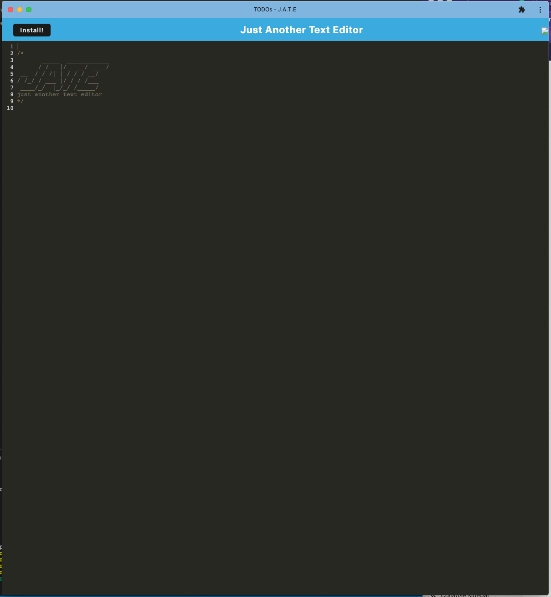

# PWA Text Editor
  
## Description
  
  * Motivations - Primarily to practice the development of a PWA..
  * Reason for building - Because a text editor is never a bad thing to have and the challenge of building a PWA sounded fun..
  * Problem solved - It provides a PWA for anyone to use.
  * Lessons learned - 
  
## Table of Contents
  
 - [Installation](#installation)
 - [Usage](#usage)
 - [License](#license)
 - [Contributing](#Contributing)
 - [Tests](#tests)
 - [Questions](#questions)

## Installation

na

## Usage

 * na
  
  
  
  
## License
    
 -MIT License
 -

## Contributing
  
 * Please visit the [Contributor Covenant](https://www.contributor-covenant.org/) to view our contributors guidelines.

## Tests

 * na

## Questions

 * For questions regarding this software, please reach out to me on [GitHub](https://github.com/dhoneyman)

## Collaborators

- [undefined](undefined)
- [undefined](undefined)

